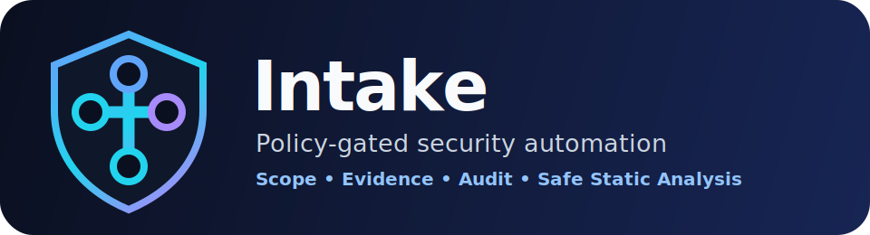

<p align="center">
  
</p>

<p align="center">
  <strong>Policy-gated security automation for authorized reverse engineering, evidence handling, and assessment workflows.</strong>
</p>

<p align="center">
  <a href="https://github.com/ChathurangaBW/Intake/actions/workflows/ci.yml"></a>
  <a href="https://github.com/ChathurangaBW/Intake/pkgs/container/intake"></a>
  <a href="https://github.com/ChathurangaBW/Intake/releases"></a>
  
  
</p>

---

## What Intake is

Intake is a local-first security automation application built around one operating rule:

> **The model proposes. Policy decides. Isolated workers execute. Evidence proves. A human authorizes sensitive actions.**

It is designed for authorized work only: reverse-engineering intake, artifact handling, policy decisions, approval workflow, safe static analysis, evidence storage, audit logging, and assessment reporting.

## Core capabilities

- FastAPI service with OpenAPI docs at `/docs`
- Browser operator console at `/ui`
- Optional API key authentication through `INTAKE_API_KEY`
- Typer operator CLI
- Python SDK client
- PostgreSQL persistence through SQLAlchemy and Alembic
- OPA/Rego policy decisions
- MinIO/S3-compatible content-addressed evidence storage
- Engagements, targets, artifacts, tool calls, approvals, audit logs, evidence, and findings
- API artifact upload and CLI artifact ingestion
- Tool catalog and tool availability endpoints
- Authorized tool-call execution path and durable job layer
- Safe local static-analysis worker for metadata and strings extraction
- Optional fixed-argument Ghidra/Rizin execution path when explicitly enabled
- Markdown report rendering
- Operations control plane for readiness, audit export, evidence verification, and engagement export
- Docker Compose development and production overlays
- CI workflow, QA markers, API contract tests, and smoke workflow
- GitHub Actions package publishing to GHCR
- GitHub Pages documentation workflow

## Operator console

Run the app and open the workbench:

```bash
cp .env.example .env
docker compose up --build
```

```text
http://127.0.0.1:8000/ui
```

The console supports the normal local operator path from the browser:

```text
create engagement
  -> add scoped target
  -> upload artifact
  -> propose tool call
  -> approve or execute authorized work
  -> store evidence
  -> create finding
  -> export report, audit log, and engagement metadata
```

If API-key auth is enabled, enter the key in the console header. The key is stored only in browser local storage.

## Guardrails

Intake does **not** expose unrestricted shell execution. It exposes typed, scoped tool contracts. Dynamic execution and active network actions are policy-gated and are not auto-run by the default runtime.

This is a deliberate product boundary, not an unfinished placeholder.

## Quick start

```bash
cp .env.example .env
docker compose up --build
```

Open:

```text
http://127.0.0.1:8000/ui
http://127.0.0.1:8000/docs
```

The API container runs Alembic migrations on startup.

## Secure local run

Set an API key before exposing the service beyond localhost:

```bash
export INTAKE_API_KEY='change-this-long-random-value'
docker compose up --build
```

Then send API requests with:

```bash
-H 'X-Intake-Api-Key: change-this-long-random-value'
```

## CLI workflow

```bash
python -m venv .venv
source .venv/bin/activate
pip install -e .[dev,orchestration]
docker compose up -d postgres opa minio
alembic upgrade head
intake doctor
```

Create an engagement:

```bash
intake engagement create eng-demo "Demo Authorized Assessment" --manifest examples/engagement.yaml
```

Add an authorized target:

```bash
intake target add eng-demo app.authorized-example.test domain
```

Ingest an artifact:

```bash
intake artifact ingest eng-demo ./sample.bin
```

Check tool availability:

```bash
intake tool status
```

Propose and execute a read-only static analysis call:

```bash
intake tool propose eng-demo analyst ghidra analyze read_only '{"artifact_id":"<artifact-id>","profile":"quick"}'
intake tool execute <tool-call-id>
```

List evidence and render a report:

```bash
intake evidence list eng-demo
intake finding report eng-demo --output report.md
```

## API workflow

```bash
curl -s http://127.0.0.1:8000/engagements \
  -H 'content-type: application/json' \
  -d '{"engagement_id":"eng-demo","name":"Demo Authorized Assessment"}'
```

```bash
curl -s http://127.0.0.1:8000/engagements/eng-demo/artifacts \
  -F 'file=@./sample.bin;type=application/octet-stream'
```

```bash
curl -s http://127.0.0.1:8000/tools/status
```

```bash
curl -s http://127.0.0.1:8000/tool-calls \
  -H 'content-type: application/json' \
  -d '{"engagement_id":"eng-demo","actor":"analyst","tool":"ghidra","operation":"analyze","risk":"read_only","arguments":{"artifact_id":"<artifact-id>","profile":"quick"}}'
```

```bash
curl -s -X POST http://127.0.0.1:8000/tool-calls/<tool-call-id>/execute
curl -s http://127.0.0.1:8000/engagements/eng-demo/report.md
```

## Package

The repository publishes a Docker image to GitHub Container Registry through `.github/workflows/package.yml`.

After the package workflow runs, pull the image with:

```bash
docker pull ghcr.io/chathurangabw/intake:main
```

For versioned releases:

```bash
git tag v0.1.0
git push origin v0.1.0
```

That triggers release/package workflows for the version tag.

## Documentation

Documentation lives in [`docs/`](docs/) and is published by the GitHub Pages workflow when Pages is enabled for GitHub Actions.

Start here:

- [Documentation home](docs/index.html)
- [Operator console](docs/OPERATOR_CONSOLE.md)
- [Application capabilities](docs/APP_CAPABILITIES.md)
- [Operations control plane](docs/OPERATIONS_CONTROL_PLANE.md)
- [QA plan](docs/QA.md)
- [Operations guide](docs/OPERATIONS.md)
- [Threat model](docs/THREAT_MODEL.md)
- [Release process](docs/RELEASE.md)
- [Package publishing](docs/PACKAGING.md)

## QA workflow

Fast checks:

```bash
make check
```

Smoke check against a running app:

```bash
make smoke
```

Combined QA gate:

```bash
make qa
```

The CI workflow runs linting, unit tests, API contract tests, and Docker image build validation.

## Enabling real Ghidra/Rizin execution

By default, Intake uses its safe built-in metadata and string extraction worker. To use installed Ghidra/Rizin binaries, enable fixed-argument external static tools:

```bash
export INTAKE_ENABLE_EXTERNAL_STATIC_TOOLS=true
export INTAKE_RIZIN_PATH=rizin
export INTAKE_GHIDRA_ANALYZE_HEADLESS_PATH=analyzeHeadless
```

The external execution path uses fixed argument vectors, not arbitrary shell strings. If a binary is missing, Intake falls back to the built-in safe static worker.

## Repository layout

```text
assets/                       Branding assets
docs/                         Documentation and GitHub Pages source
src/intake/                   Python package
src/intake/api.py             FastAPI app
src/intake/auth.py            Optional API key auth
src/intake/web.py             Browser operator console
src/intake/cli.py             Operator CLI
src/intake/services.py        Runtime application service layer
src/intake/models.py          SQLAlchemy persistence models
src/intake/storage.py         Content-addressed evidence store
src/intake/tool_runtime.py    Default constrained tool registry
src/intake/scope.py           Engagement scope validation
src/intake/tools/             Typed tool wrappers
src/intake/workers/           Static/dynamic worker contracts and static workers
migrations/                   Alembic migrations
policies/                     OPA/Rego policy
examples/                     Example engagement manifest, HTTP collection, SDK sample
scripts/                      Smoke and helper scripts
```

## Safety boundary

This project is for systems, binaries, applications, and networks that you own or are explicitly authorized to assess. It is not designed to bypass authorization, evade detection, establish persistence, perform destructive actions, or automate activity outside a signed engagement scope.
